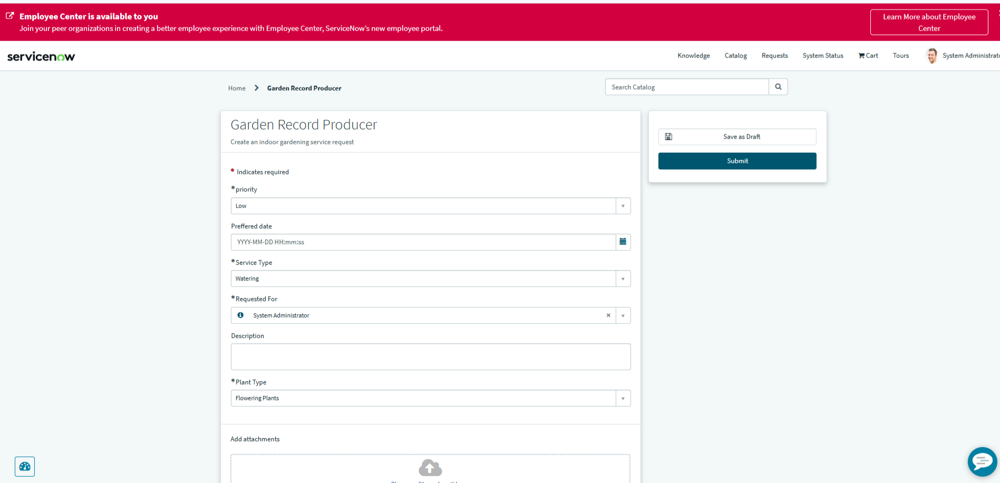
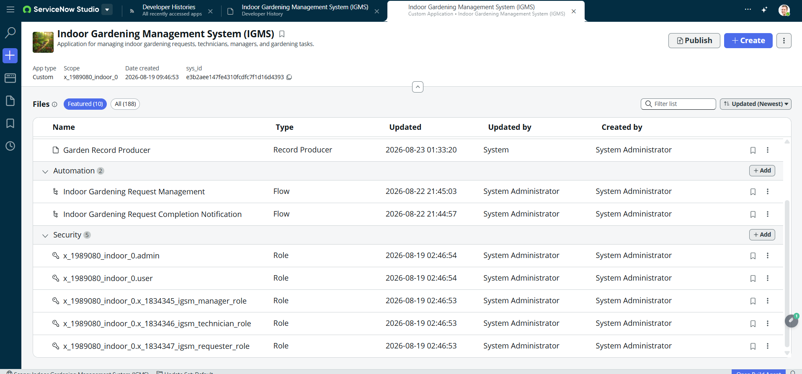
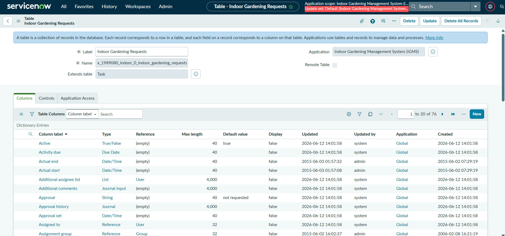
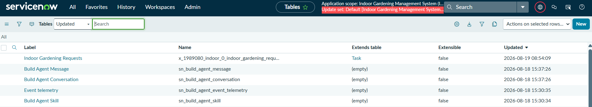
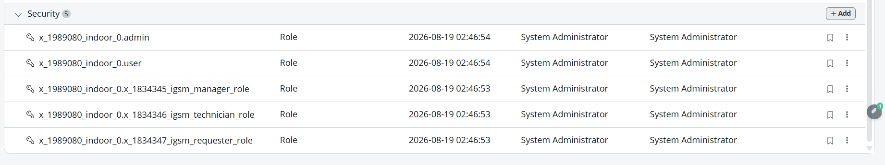
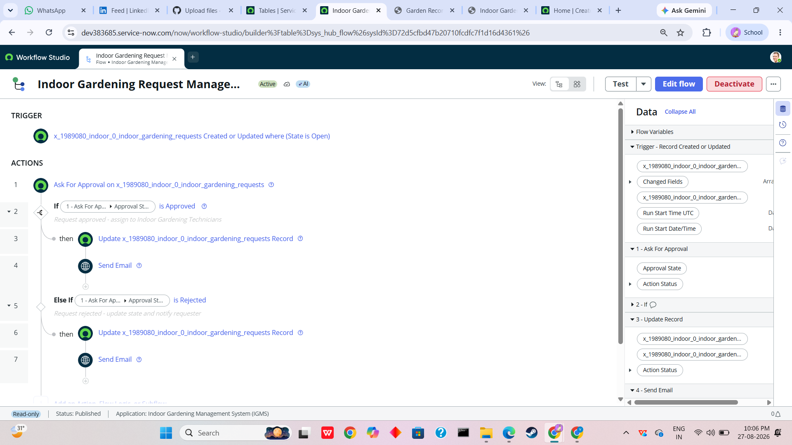

# Indoor Gardening Management System (IGMS)

## Project Overview

The **Indoor Gardening Management System (IGMS)** is a custom ServiceNow application designed to manage indoor gardening requests and support requesters, technicians, managers, and gardening tasks.

The application was developed using ServiceNow's scoped application development, Service Portal, and low-code capabilities.

## Application Details

| Property          | Details                            |
| ----------------- | ---------------------------------- |
| Application Name  | Indoor Gardening Management System |
| Application Type  | Custom                             |
| Platform          | ServiceNow                         |
| Application Scope | `x_1989080_indoor_0`               |
| Created           | August 19, 2026                    |

---

## System Architecture

```text
User
  ↓
ServiceNow Service Portal
  ↓
IGMS Home Page
  ↓
Create Gardening Request
  ↓
Garden Record Producer
  ↓
Indoor Gardening Requests
  ↓
Flow Designer
  ↓
Approval / Completion Notification
```

---

## Main Components

### 1. Indoor Gardening Requests

A custom table named **Indoor Gardening Requests** was created for managing indoor gardening service requests.

The table extends the **Task** table and stores information related to gardening requests.

### 2. Request Fields

The table contains fields including:

* Number
* Priority
* Assigned To
* State
* Configuration Item
* Requested For
* Customer
* Requested Date
* Plant Type
* Indoor Plant Category
* Service Type
* Active
* Short Description
* Description
* Work Notes

### 3. Application Roles

Five application roles were created:

* `x_1989080_indoor_0.admin`
* `x_1989080_indoor_0.user`
* `x_1989080_indoor_0.x_1834345_igsm_manager_role`
* `x_1989080_indoor_0.x_1834346_igsm_technician_role`
* `x_1989080_indoor_0.x_1834347_igsm_requester_role`

### 4. Service Portal Frontend

The user-facing frontend was implemented using **ServiceNow Service Portal**.

#### IGMS Home Page

A custom Service Portal page named **`igms`** provides a dashboard-style interface with options for:

* **Create Gardening Request**
* **My Gardening Requests**

#### Create Gardening Request

The **Create Gardening Request** option opens the actual **Garden Record Producer** directly, allowing users to submit an indoor gardening request.

#### My Gardening Requests

A custom Service Portal page named **`igms_my_requests`** displays the user's gardening requests, including:

* Request Number
* Plant Type
* Service Type
* Priority
* State

### 5. Garden Record Producer

A **Garden Record Producer** was created and mapped to the **Indoor Gardening Requests** table.

Variables were created and mapped to the relevant request fields.

The Record Producer serves as the user-facing request form from the Service Portal.

### 6. Flow Designer

Two flows were created for the Indoor Gardening Management System.

#### Indoor Gardening Request Management

**Trigger:**

`Indoor Gardening Requests Created or Updated`

**Actions:**

1. Create or Update Record
2. Ask For Approval on Indoor Gardening Requests

The flow was tested successfully using ServiceNow's test functionality.

#### Indoor Gardening Request Completion Notification

A second flow named **Indoor Gardening Request Completion Notification** was created.

The flow is associated with the Indoor Gardening Requests table and uses a **Send Email** action for completion notification based on its configured trigger conditions.

### 7. Approval Relationship

A relationship named **Indoor Gardening Request Approvals** was created.

It connects:

* **Applies to table:** Indoor Gardening Requests
* **Queries from table:** Approval `[sysapproval_approver]`

This relationship allows approval information to be associated with the Indoor Gardening Requests form.

---

## Technologies and Platform

* ServiceNow
* ServiceNow Studio
* Workflow Studio
* Service Portal
* Table Builder
* Flow Designer
* Record Producer
* Scoped Application Development

---

## Project Workflow

```text
User
  ↓
IGMS Service Portal
  ↓
IGMS Home Page
  ↓
Create Gardening Request
  ↓
Garden Record Producer
  ↓
Indoor Gardening Requests
  ↓
Request Management Flow
  ↓
Approval
  ↓
Completion Notification
```

---

## Project Status

The Indoor Gardening Management System has been implemented as a custom ServiceNow scoped application.

The implemented solution includes:

* ServiceNow scoped application
* Service Portal frontend
* Custom IGMS Home page
* My Gardening Requests page
* Garden Record Producer
* Indoor Gardening Requests table
* Task table extension
* Application roles
* Request management flow
* Completion notification flow
* Approval relationship
* Tested request-management automation

---

## Screenshots

### Service Portal Frontend

#### IGMS Home Page


#### My Gardening Requests



### ServiceNow Application

#### Application



#### Indoor Gardening Requests Table



#### Request Records



#### Application Roles



#### Garden Record Producer


#### Request Management Flow



#### Flow Test


#### Approval Relationship


#### Completion Notification


---

## Application Scope

```text
x_1989080_indoor_0
```

## Author

**Sofiya C.**
